# ProPortion manual

ProPortion is the Android app that rescales your recipes: change the number of servings, fix the
amount of one ingredient you have already measured, or simply say what is in your cupboard, and
the app recalculates everything else — quantities, warnings about impractical roundings, and even
a notice when you are baking in a tin much larger or smaller than usual.

This manual follows **a single worked example recipe, from entry through to cooking**, so every
step is shown applied to the same concrete case rather than a different example each time.

> **A note on the pictures.** All screenshots below are real, captured on a physical device
> (Fairphone 3) with the app set to English. A couple of steps in sections 4 and 5 are not yet
> illustrated with a screenshot — the described behaviour is accurate, just not pictured here.

## The worked example: Apple cake

For 6 servings, with the built-in tags **Dessert** and **Oven**, plus the free tag **Autumn**.

| Ingredient | Quantity |
|---|---|
| Flour | 350 g |
| Sugar | 200 g |
| Butter | 100 g |
| Eggs | 3 |
| Apples | 4 pieces |
| Baking powder | 1 sachet |
| Salt | to taste |

Method:

1. Beat the eggs with the sugar until pale and foamy.
2. Add the melted butter and the flour sifted with the baking powder and a pinch of salt.
3. Fold in the apples, cut into small pieces.
4. Pour the batter into a buttered 24 cm tin and bake at 180 °C for 45 minutes.

We will use this recipe throughout all ten steps below.

---

## 1. Enter a recipe

The very first time you open the app, before any recipe has been added, the **Home** tab is
empty and invites you to add your first recipe.

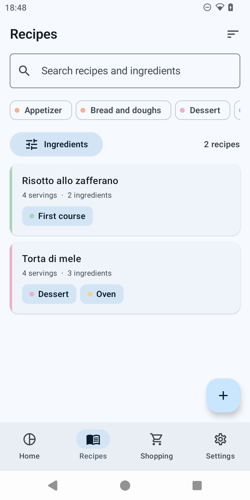

*(On a genuinely empty library, this screen shows an illustration and an "Add a recipe" button
instead of a list — same entry point, no recipe to tap through to yet.)*

1. Open the **Recipes** tab from the bottom navigation bar and tap the **+** button (FAB) in the
   bottom right — or tap **"Add a recipe"** from the empty state on Home or on Recipes. The
   editor opens with the title **"New recipe"**.
2. In the **"Recipe name"** field, type `Apple cake`.
3. Next to **"Servings"**, use the **+**/**−** buttons to bring the number to `6`.
4. In the **"Tags"** section, tap the built-in chips **Dessert** and **Oven** to select them,
   then type `Autumn` into the **"New tag"** field and tap the **+** button next to it to create
   it and add it to the recipe.
5. In the **"Ingredients"** section, tap **"Add ingredient"** once for every row in the table
   above. For each row: type the name into the **"Ingredient"** field (as you type, suggestions
   from the existing catalogue appear, so ingredients already used in other recipes are not
   duplicated), enter the **"Quantity"**, then open the unit picker and choose the right unit
   (for **Salt**, choose the approximate unit **to taste**, which makes the quantity field
   unnecessary). Rows can be reordered and removed with the bin icon.
6. In the **"Method"** section, tap **"Add step"** four times and type the four method steps
   above, one per **"Step 1"**, **"Step 2"** field, and so on.
7. Tap the check icon (✓) in the top right to save. If the title is missing or there is not at
   least one ingredient, the app shows a clear error under the relevant field ("Give the recipe a
   name", "Add at least one ingredient", "Enter a quantity, or pick an approximate unit") and
   will not save until it is fixed.
8. If at any point you tap the back arrow with unsaved changes, the app asks for confirmation
   with the **"Discard changes?"** dialog ("The changes you made will be lost."), with the
   options **"Discard"** and **"Keep editing"**.

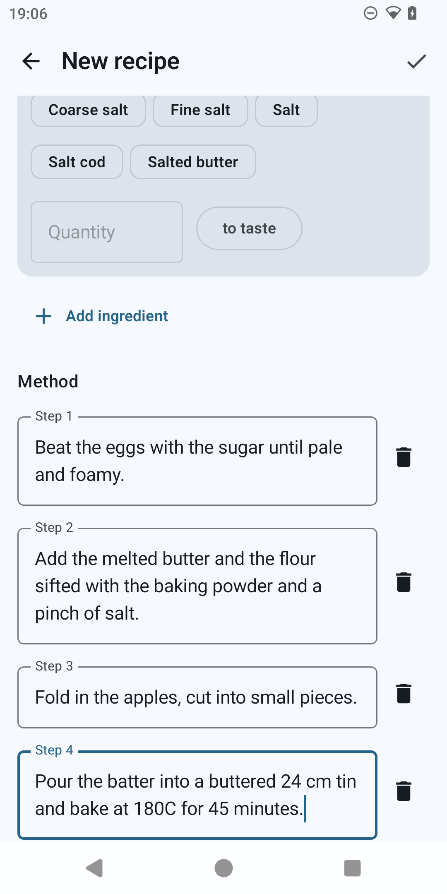

---

## 2. Find it again

With more than one recipe in the library, the Recipes tab is found and filtered like this.

1. Open the **Recipes** tab. At the top is the search field with the placeholder **"Search
   recipes and ingredients"**: type `apple` to bring up the Apple cake (search is case- and
   accent-insensitive and starts 200 ms after you stop typing).
2. Below the search field, tap the **Dessert** tag chip to narrow it down further to desserts
   only: the two filters (text and tags) combine with AND.
3. Tap the **"Ingredients"** button to open the **"Filter by ingredient"** sheet: tick the
   checkbox next to `Flour` to show only recipes that contain **all** of the selected
   ingredients. The result count at the top ("1 recipe") updates with every filter; the
   **"Clear filters"** button, present both in the sheet and in the list when there are no
   results, removes every applied filter at once.
4. The sort icon in the top right opens a menu with **"Recently updated"** (default),
   **"A to Z"** and **"Most cooked"**.
5. Tap the recipe's card to open its detail screen.

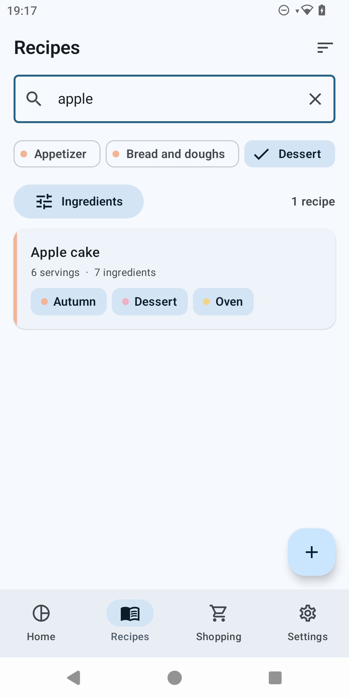

*(The "Filter by ingredient" sheet is not pictured in this pass — the description above is
accurate.)*

---

## 3. Rescale by servings

From the recipe's detail screen, tap the **"Cook this recipe"** button: the scale screen opens,
titled with the recipe's own name. At the top is a row of four chips selecting the constraint
mode: **Servings**, **Ingredient**, **Factor**, **Pantry** — all four are always visible,
whichever mode is active.

1. With the **Servings** chip selected (it is the default mode), use the **+**/**−** buttons next
   to the large number to bring it from `6` to `9`. Below it, the caption **"from 6 · factor
   1.5"** appears.
2. The ingredient list below recomputes live, with the numbers animating to their new value:
   Flour → 525 g, Sugar → 300 g, Butter → 150 g, Apples → 6 pieces, Salt stays to taste.
3. The **Eggs** row shows an amber warning badge: the exact value would be 4.5 eggs, not
   practical to measure. The text reads **"4.5 is not a practical amount"** and offers two
   rounding chips, **"Round to 4 eggs"** and **"Round to 5 eggs"**; the **Baking powder** row
   shows the same kind of warning too (1.5 sachets), with the chips **"Round to 1 sachet"** and
   **"Round to 2 sachets"**. Tapping any one of these chips recomputes the whole list from
   scratch on the resulting factor — the rounding does not touch only that one row.
4. Because the recipe carries the **Oven** tag and the factor (1.5) is outside the 0.7–1.4 band,
   a non-blocking notice appears: **"Baking does not scale in proportion"**, with the text
   "Check for doneness early: time and temperature do not follow the factor. For the same batter
   depth, use a tin about 1.22 times the diameter." — that is, a 24 cm tin becomes roughly a
   29 cm one. The notice never touches the method steps.
5. Tap **"View the card"** to switch to the scaled card: the same layout as the recipe detail
   screen, but with the new quantities and the same heading **"For 9 servings"**; the method is
   identical, word for word. From there, **"Adjust again"** goes back to the previous screen.

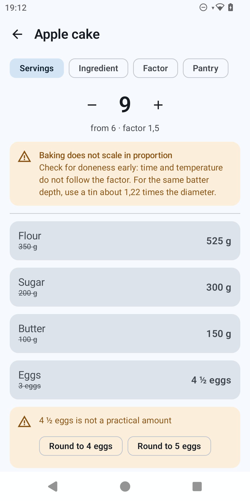

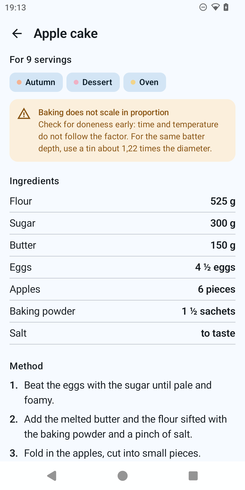

*(**Factor** mode, visible as the third chip in the row above, lets you enter a straight
multiplier directly, with three quick presets ×0.5, ×2, ×3, instead of thinking in servings or
ingredients; the rest of the behaviour — warnings, oven notice, scaled card — is identical.)*

---

## 4. Rescale by fixing one ingredient ("I only have 2 eggs")

Sometimes the constraint is not the number of servings but how much of one ingredient you have
already measured.

1. From the scale screen, tap the **Ingredient** chip. The text **"Tap the ingredient you want
   to fix"** appears, followed by a row of chips, one for every scalable ingredient in the
   recipe (Flour, Sugar, Butter, Eggs, Apples, Baking powder — not Salt, which is approximate).
2. Tap the **Eggs** chip: an **"I have"** field appears. Type `2` (you only have two, instead of
   the 3 the recipe calls for).
3. The caption below shows **"from 6 · factor 0.67"** and the whole list recomputes: Flour →
   235 g, Sugar → 135 g, Butter → 67 g, Eggs → 2 (exact, it is the constraint itself), Apples →
   a row with a warning badge (an exact 2.667 pieces, not practical) with the chips **"Round to
   2 pieces"** and **"Round to 3 pieces"**, Baking powder → a row with a warning badge and a
   single chip **"Round to 1 sachet"** (rounding down would give zero, and the app never lets a
   discrete ingredient drop to nothing: it clamps it to 1 while still showing the warning).
4. The oven notice reappears, this time with a different message: with the factor (0.67) still
   outside the 0.7–1.4 band but this time on the low side, the text reads "...use a tin about
   0.82 times the diameter" — from 24 cm down to roughly 20 cm. The notice does not depend on
   which scaling mode was used, only on the resulting factor: whichever route gets you to a
   factor outside the band makes it appear.

*(Not pictured in this pass — the equivalent screen in Italian is in `docs/manual/it/manual.md`,
section 4. The behaviour is identical, only the labels differ.)*

---

## 5. Rescale by what is in the cupboard

**Pantry** mode answers the opposite question: "with what I actually have at home, how many
servings can I make?"

1. From the scale screen, tap the **Pantry** chip. The text **"Tell me how much you have and I
   will work out the most you can make"** appears, followed by one row per scalable ingredient,
   each showing the recipe's original amount and an **"I have"** field.
2. In the **"I have"** field of the **Butter** row, type `60` (you only have 60 g instead of the
   100 g called for); in the **"I have"** field of the **Flour** row, type `300` (you have 300 g
   instead of 350 g). Leave the other rows empty: Pantry mode only considers ingredients for
   which you entered an amount.
3. The app computes a candidate factor for each ingredient you entered (Butter: 60/100 = 0.6;
   Flour: 300/350 ≈ 0.86) and takes the smallest one: **Butter** becomes the **bottleneck** —
   its row shows the **"Bottleneck"** label under the name — and the overall factor is 0.6.
4. Below the rows, **"You can make about 3.6 servings"** appears: with what you have, the cake
   only works out to a non-whole number of servings, and the app says so plainly instead of
   silently rounding.
5. Since you entered more flour than the 0.6 factor actually needs (it needs 210 g), a line at
   the bottom reads **"Left over: Flour 90 g"**: that is what will be left in your cupboard after
   making the cake at this scale.
6. The same warnings about impractical discrete amounts appear here too (Eggs at 1.8, with the
   chips **"Round to 1 egg"** and **"Round to 2 eggs"**; Apples at 2.4, with the chips **"Round
   to 2 pieces"** and **"Round to 3 pieces"**; Baking powder at 0.6, with the single chip
   **"Round to 1 sachet"**), along with the oven notice, on the same principle as the previous
   sections (here the ratio is "about 0.77 times").

*(Not pictured in this pass — see `docs/manual/it/manual.md`, section 5, for the equivalent
screen.)*

---

## 6. Save a scaling, and set one as the recipe's default

A scaling computed on the fly can be saved to reopen later without recomputing it.

1. Go back to **Servings** mode set to `9` (section 3). From either the adjustment screen or the
   scaled card, tap **"Save this scaling"**.
2. The **"Save this scaling"** dialog opens with the **"Name"** field already filled in with
   **"For 9 servings"** (you can edit it freely) and, below it, a row with a checkbox and the
   text **"Show this scaling by default when opening the recipe"**.
3. Tick that checkbox, then tap **"Save"** (it stays disabled while the name is empty). The
   **"Cancel"** button closes the dialog without saving.
4. Go back to the recipe's detail screen: below the method, a **"Saved scalings"** section now
   appears with a **"For 9 servings"** card. Tapping it makes the detail screen show that
   scaling's quantities, with the banner **"Showing: For 9 servings · View original"** at the
   top; tapping **"View original"** goes back to the 6-servings quantities.
5. Because you set this scaling as the default, the next time you open Apple cake from Recipes,
   the detail screen opens already showing the 9-servings quantities, with the same banner at the
   top — until you explicitly tap "View original" or another scaling.

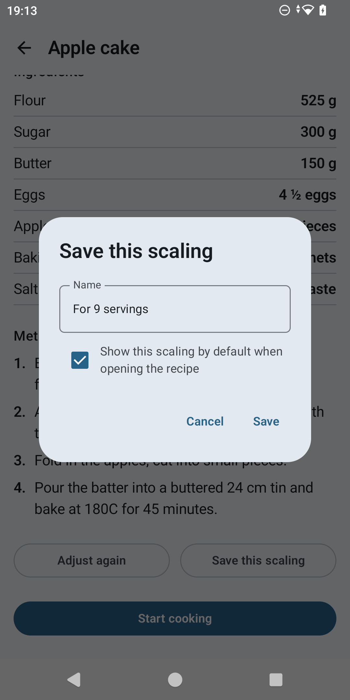

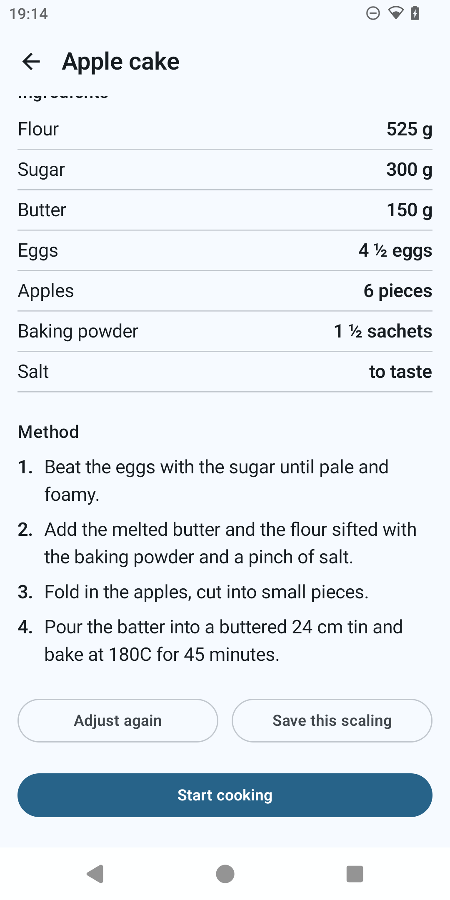

---

## 7. Cook it

Cooking mode keeps the screen permanently on, enlarges the text, and lets you check off steps as
you cook, with the quantities always one tap away.

1. From the scaled card (section 3 or 6), tap **"Start cooking"** at the bottom. Entering
   cooking mode logs the cook: it increments the recipe's "cooked N times" count and updates its
   last-cooked date (which is why it later shows up in the "Continue cooking" card on Home,
   section 10).
2. The top bar shows the recipe's title, a close (X) icon on the left, and on the right the
   progress **"0 / 4"** (zero of four steps done).
3. Each step is large text with a checkbox. Tap the checkbox (or the whole row) of the first step
   to mark it done: the text gets struck through and turns grey, and the counter at the top moves
   to **"1 / 4"**.
4. The **"Ingredients"** button in the bottom right (with a book icon) opens a sheet with the
   caption **"For 9 servings"** and the list of every ingredient with the quantities of the
   scaling in use, without having to leave cooking mode.
5. The X in the top left closes cooking mode and returns to the recipe's detail screen. The
   screen is free to turn off on its own again.

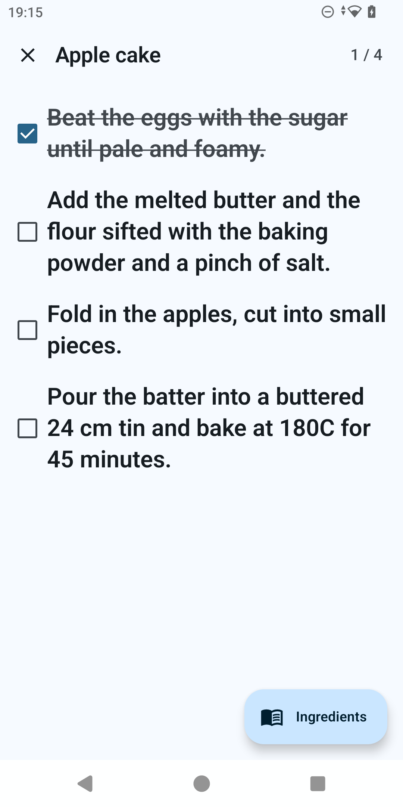

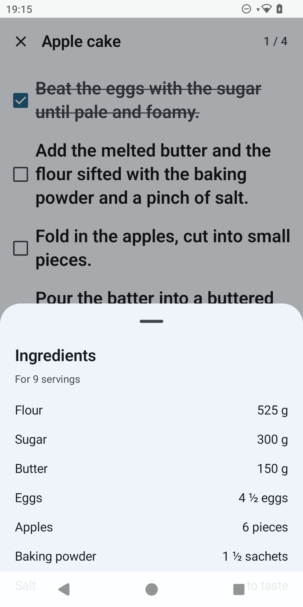

---

## 8. Share a recipe as text and as a file; receive one back

From the recipe's detail screen, the three-dot menu in the top right ("More actions") offers
**Edit**, **Share as text**, **Share as a .proportion file** and **Delete**.

1. Open the Apple cake detail screen and tap the three-dot icon, then **"Share as text"**.
   Android's own share sheet opens, titled **"Share recipe"**, with text ready to paste into a
   messaging app: title, servings, aligned ingredients, numbered method, and, at the bottom, the
   discreet line **"Shared with ProPortion"**. If you are currently viewing a scaling (section
   6) when you share, that scaling is what gets shared — with the line **"Rescaled for 9
   servings"** instead of "For 6 servings" — not the original recipe.
2. Tap the three-dot icon again, then **"Share as a .proportion file"**: the same kind of share
   sheet opens, this time for a file (`apple-cake.proportion`) generated on the spot and attached
   via `FileProvider` — useful for sending the recipe to another ProPortion user with everything
   intact (tags, ingredients, saved scalings), not just the readable text.
3. **To receive a recipe**: when someone sends you a `.proportion` file (over chat or email, for
   instance) and you open it from whichever app received it, Android opens it with ProPortion —
   the app is registered for the `.proportion` extension. ProPortion opens straight into the
   **Settings** screen, with the same preview dialog used for restoring a backup (section 9): how
   many recipes the file contains and how many are already in your library, with a choice
   between **"Merge"** and **"Replace everything"**.

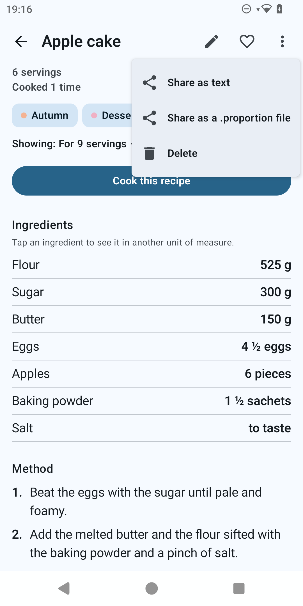

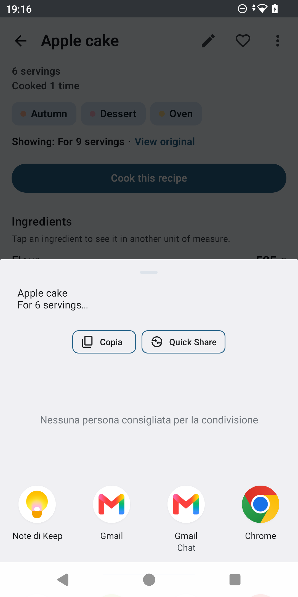

*(The "received .proportion file" screen is not pictured — it reuses the same Restore dialog
shown in section 9 below.)*

---

## 9. Back up and restore the whole library

From the **Settings** tab, the **"Your recipes"** section offers backup and restore for the
entire library (every recipe, tags, the ingredient catalogue and saved scalings).

1. Open **Settings** and tap **"Back up all recipes"** (subtitle: "Writes a .proportion file
   wherever you choose."). The system picker opens to choose where to save the file; once a
   destination is chosen, the confirmation **"Backup saved"** appears.
2. To restore, tap **"Restore from a backup"** (subtitle: "Reads a .proportion file and asks
   before changing anything.") and pick a `.proportion` file with the system picker.
3. Before writing anything, the **"Restore"** dialog appears with the count, for example **"42
   recipes in this file, 12 already here."**, and two choices: **"Merge"** (recipes already
   present, matched by their unique id, are not duplicated) or **"Replace everything"**.
4. Choosing **"Replace everything"** brings up a second, explicit confirmation, because it is
   destructive: **"Replace every recipe?"** ("Your current recipes will be deleted and replaced
   by the ones in this file."), with the **"Replace"** and **"Cancel"** buttons.
5. At the end, a final dialog summarises the outcome: **"X recipes added, Y skipped"** for
   **Merge**, or **"X recipes restored"** for **Replace everything**, with an **"OK"** button. If
   the file is not valid, the app instead shows one of three clear error messages: "This is not a
   ProPortion file.", "This file was written by a newer version of the app (N)." or "This file
   could not be read."

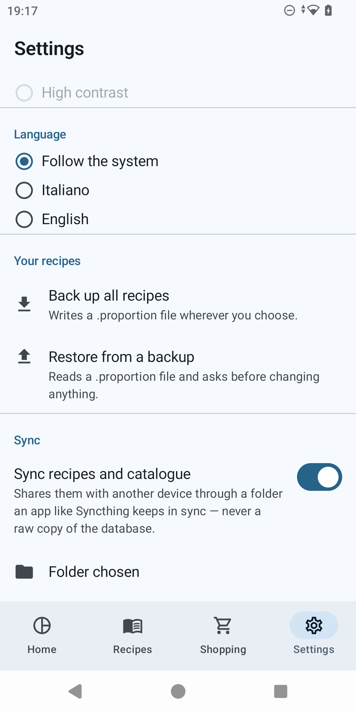

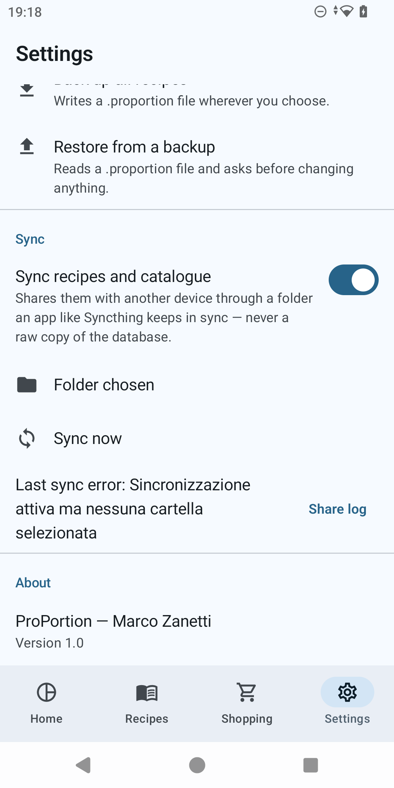

*(The Restore dialog and the final outcome dialog are not pictured in this pass — the file picker
step needs a real backup file on the device to select.)*

---

## 10. The dashboard and the shopping list

With a few recipes in the library — including Apple cake cooked at least once (section 7) — Home
shows four animated cards on entry.

1. The **"Your library"** card shows an animated donut with the number of recipes per course at
   the centre, the legend beside it (for instance "Dessert · 1"), and below it two lines with the
   total cooks logged and the number of favourites.
2. The **"Continue cooking"** card shows the last recipe cooked — Apple cake — with, if a scaling
   was in use, the line **"Saved as For 9 servings"**, and a **"Cook"** button that reopens
   cooking mode directly with that same scaling.
3. The **"Most cooked"** card places two columns side by side, **"Most cooked"** and
   **"Favourites"**: to add Apple cake to your favourites, open its detail screen and tap the
   heart icon in the top right (it switches from outline to filled).
4. The **"What shall I cook?"** card suggests a random recipe, filterable by course with the
   chips at the top (including the **"All courses"** chip); the shuffle icon suggests another
   idea with a small reshuffle animation.
5. Open the **Shopping** tab: ingredients added from the scale screen (the **"Add to shopping
   list"** button, sections 3–5) land here as a single list. Quantities of the same ingredient
   are merged when the units are compatible (for instance 300 g and 0.2 kg become 500 g) and stay
   separate when they are not; any row that comes from more than one recipe shows a note under
   the name such as **"From 2 recipes"**. Tap the checkbox to mark an item as already bought: the
   text gets struck through.
6. The three-dot menu in the top right of the shopping list offers **"Share"** (opens the system
   share sheet with the list as plain text, titled **"Share shopping list"**), **"Clear
   checked"** (enabled only when at least one item is checked) and **"Clear all"**, which asks
   for confirmation first with the **"Clear the whole list?"** dialog ("Every item, checked or
   not, will be removed.").

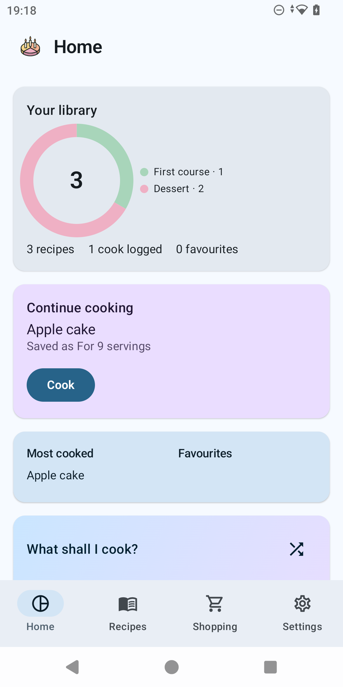

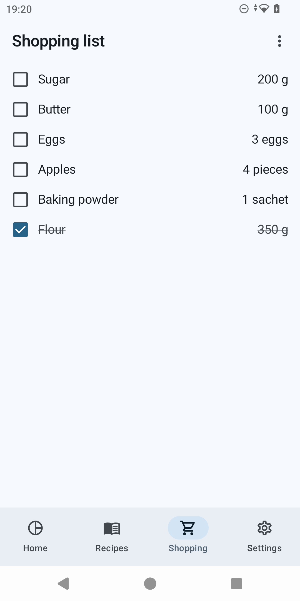
