# Manuale di ProPortion

ProPortion è l'app Android che riproporziona le tue ricette: cambi il numero di persone, fissi la
quantità di un ingrediente che hai già misurato, o dici semplicemente cosa hai in dispensa, e
l'app ricalcola tutto il resto — quantità, avvisi su arrotondamenti poco pratici, e persino un
avviso quando stai cuocendo al forno una teglia molto più grande o più piccola del solito.

Questo manuale segue **una sola ricetta d'esempio, dall'inserimento alla cottura**, cosicché ogni
passaggio si vede applicato allo stesso caso concreto invece che a un esempio diverso ogni volta.

> **Nota sulle immagini.** Tutte le schermate qui sotto sono reali, catturate su dispositivo
> fisico (Fairphone 3) con l'app impostata in italiano.

## La ricetta d'esempio: Torta di mele

Per 6 persone, con i tag **Dolce**, **Al forno** e il tag libero **Autunno**.

| Ingrediente | Quantità |
|---|---|
| Farina 00 | 350 g |
| Zucchero | 200 g |
| Burro | 100 g |
| Uova | 3 |
| Mele | 4 pezzi |
| Lievito per dolci | 1 bustina |
| Sale | q.b. |

Procedimento:

1. Sbatti le uova con lo zucchero fino a ottenere un composto chiaro e spumoso.
2. Aggiungi il burro fuso, la farina setacciata con il lievito e un pizzico di sale.
3. Incorpora le mele tagliate a pezzetti.
4. Versa il composto in una teglia da 24 cm imburrata e inforna a 180 °C per 45 minuti.

Useremo questa ricetta in tutti e dieci i passaggi che seguono.

---

## 1. Inserisci una ricetta

Alla primissima apertura, prima di aver aggiunto qualunque ricetta, la scheda **Home** è vuota e
invita ad aggiungere la prima ricetta.

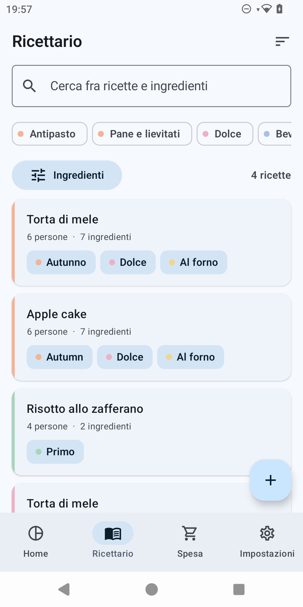

*(Con una libreria davvero vuota questa schermata mostra un'illustrazione e il pulsante "Aggiungi
una ricetta" al posto dell'elenco — stesso punto d'ingresso, nessuna ricetta ancora da aprire.)*

1. Apri la scheda **Ricettario** dalla barra di navigazione in basso e tocca il pulsante **+**
   (FAB) in basso a destra — oppure tocca **"Aggiungi una ricetta"** dallo stato vuoto della Home
   o del Ricettario. Si apre l'editor con il titolo **"Nuova ricetta"**.
2. Nel campo **"Nome della ricetta"** scrivi `Torta di mele`.
3. Accanto a **"Persone"** usa i pulsanti **+**/**−** per portare il numero a `6`.
4. Nella sezione **"Tag"** tocca i chip predefiniti **Dolce** e **Al forno** per selezionarli, poi
   scrivi `Autunno` nel campo **"Nuovo tag"** e tocca il pulsante **+** accanto per crearlo e
   aggiungerlo alla ricetta.
5. Nella sezione **"Ingredienti"** tocca **"Aggiungi ingrediente"** una volta per ogni riga della
   tabella qui sopra. Per ciascuna riga: scrivi il nome nel campo **"Ingrediente"** (mentre digiti
   compaiono suggerimenti dal catalogo esistente, così ingredienti già usati in altre ricette non
   vengono duplicati), inserisci la **"Quantità"**, quindi apri il selettore d'unità e scegli
   l'unità giusta (per **Sale** scegli l'unità approssimativa **q.b.**, che rende il campo
   quantità non necessario). Le righe si possono riordinare e rimuovere con l'icona del cestino.
6. Nella sezione **"Procedimento"** tocca **"Aggiungi passo"** quattro volte e scrivi i quattro
   passi del procedimento qui sopra, uno per campo **"Passo 1"**, **"Passo 2"**, e così via.
7. Tocca l'icona di spunta (✓) in alto a destra per salvare. Se manca il titolo o non c'è almeno
   un ingrediente, l'app mostra un messaggio d'errore sotto il campo interessato ("Dai un nome
   alla ricetta", "Aggiungi almeno un ingrediente", "Inserisci una quantità, oppure scegli
   un'unità approssimativa") e non salva finché non è risolto.
8. Se in qualunque momento tocchi la freccia indietro con modifiche non salvate, l'app chiede
   conferma con il dialogo **"Scartare le modifiche?"** ("Le modifiche fatte andranno perse."),
   con le opzioni **"Scarta"** e **"Continua a modificare"**.

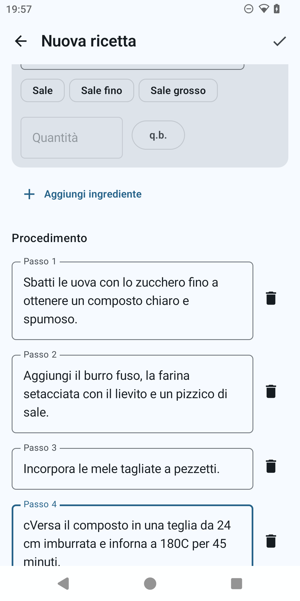

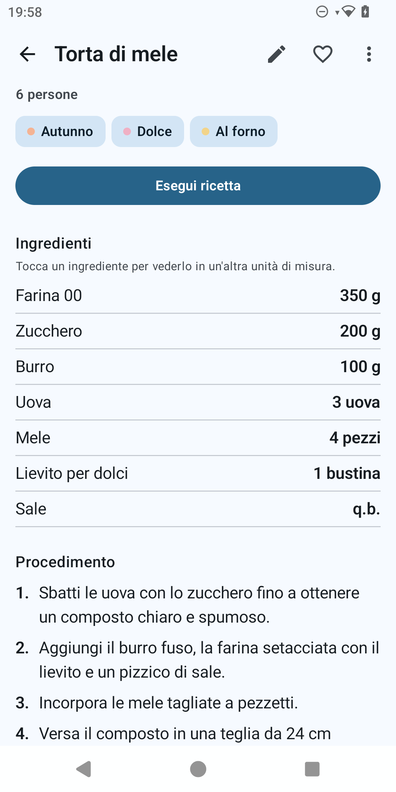

---

## 2. Ritrovarla

Con più ricette in libreria, il Ricettario si trova e si filtra così.

1. Apri la scheda **Ricettario**. In alto trovi il campo di ricerca con il suggerimento **"Cerca
   fra ricette e ingredienti"**: scrivi `mele` per far comparire la Torta di mele (la ricerca è
   case- e accento-insensibile e parte 200 ms dopo che smetti di digitare).
2. Sotto il campo di ricerca, tocca il chip tag **Dolce** per restringere ulteriormente ai soli
   dolci: i due filtri (testo e tag) si combinano in AND.
3. Tocca il pulsante **"Ingredienti"** per aprire il foglio **"Filtra per ingrediente"**: seleziona
   la casella accanto a `Farina 00` per mostrare solo le ricette che contengono **tutti** gli
   ingredienti selezionati. Il conteggio risultati in alto ("1 ricetta") si aggiorna a ogni
   filtro; il pulsante **"Azzera i filtri"**, presente sia nel foglio sia nell'elenco quando non
   ci sono risultati, rimuove tutti i filtri applicati in un colpo solo.
4. L'icona di ordinamento in alto a destra apre un menu con **"Modificate di recente"**
   (predefinito), **"Dalla A alla Z"** e **"Più cucinate"**.
5. Tocca la scheda della ricetta per aprirne il dettaglio.

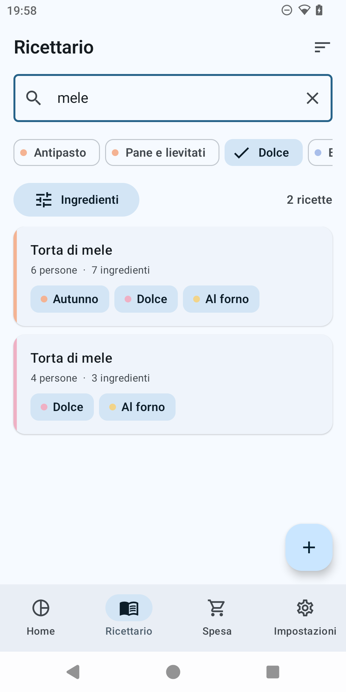

*(Il foglio "Filtra per ingrediente" non è illustrato in questo giro — la descrizione sopra resta
accurata.)*

---

## 3. Riproporziona per persone

Dal dettaglio della ricetta, tocca il pulsante **"Esegui ricetta"**: si apre la schermata di
scalatura, intestata col nome della ricetta stessa. In alto trovi una riga di quattro chip che
selezionano la modalità di vincolo: **Persone**, **Ingrediente**, **Fattore**, **Dispensa** — sono
sempre visibili tutte e quattro, qualunque sia la modalità attiva.

1. Con il chip **Persone** selezionato (è la modalità predefinita), usa i pulsanti **+**/**−**
   accanto al numero grande per portarlo da `6` a `9`. Sotto compare la didascalia
   **"da 6 · fattore 1,5"**.
2. L'elenco ingredienti sotto si ricalcola in diretta, con i numeri che si animano al nuovo
   valore: Farina 00 → 525 g, Zucchero → 300 g, Burro → 150 g, Mele → 6 pezzi, Sale resta q.b.
3. La riga **Uova** mostra un badge d'avviso ambra: il valore esatto sarebbe 4,5 uova, non pratico
   da misurare. Il testo recita **"4,5 non è una quantità pratica"** e propone due chip di
   arrotondamento, **"Arrotonda a 4 uova"** e **"Arrotonda a 5 uova"**; anche il **Lievito per
   dolci** mostra lo stesso tipo di avviso (1,5 bustine) con i chip **"Arrotonda a 1 bustina"** e
   **"Arrotonda a 2 bustine"**. Toccando uno qualunque di questi chip, l'intero elenco si
   ricalcola da capo sul nuovo fattore risultante — l'arrotondamento non tocca solo quella riga.
4. Poiché la ricetta porta il tag **Al forno** e il fattore (1,5) è fuori dalla fascia 0,7–1,4,
   compare un avviso non bloccante: **"La cottura non si scala in proporzione"**, con il testo
   "Controlla la cottura in anticipo: tempi e temperatura non seguono il fattore. A parità di
   altezza dell'impasto, usa una teglia di diametro circa 1,22 volte." — cioè da una teglia da
   24 cm si passa a una da circa 29 cm. L'avviso non tocca mai il procedimento.
5. Tocca **"Vedi la scheda"** per passare alla scheda scalata: stesso impaginato del dettaglio
   ricetta, ma con le nuove quantità e con la stessa intestazione **"Per 9 persone"**; il
   procedimento resta identico, parola per parola. Da qui **"Torna a regolare"** riporta alla
   schermata precedente.

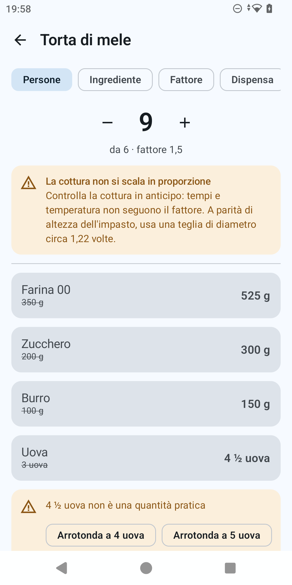

*(La modalità **Fattore**, visibile come terzo chip nella riga sopra, permette di inserire
direttamente un moltiplicatore con tre preset rapidi ×0,5, ×2, ×3, invece di ragionare in persone
o ingredienti; il resto del comportamento — avvisi, avviso forno, scheda scalata — è identico.)*

---

## 4. Riproporziona fissando un ingrediente ("Ho solo 2 uova")

A volte il vincolo non è il numero di persone ma quanto hai già misurato di un ingrediente.

1. Dalla schermata di scalatura, tocca il chip **Ingrediente**. Compare il testo **"Tocca
   l'ingrediente che vuoi fissare"** e sotto una riga di chip, uno per ogni ingrediente
   scalabile della ricetta (Farina 00, Zucchero, Burro, Uova, Mele, Lievito per dolci — non Sale,
   che è approssimativo).
2. Tocca il chip **Uova**: compare un campo **"Ho"**. Scrivi `2` (ne hai solo due, invece delle 3
   della ricetta originale).
3. La didascalia sotto mostra **"da 6 · fattore 0,67"** e l'intero elenco si ricalcola: Farina 00
   → 235 g, Zucchero → 135 g, Burro → 67 g, Uova → 2 (esatto, è il vincolo stesso), Mele → riga con
   badge d'avviso (2,667 pezzi esatti, non pratico) con i chip **"Arrotonda a 2 pezzi"** e
   **"Arrotonda a 3 pezzi"**, Lievito per dolci → riga con badge d'avviso e un solo chip
   **"Arrotonda a 1 bustina"** (l'arrotondamento all'ingiù darebbe zero, e l'app non permette mai
   di azzerare del tutto un ingrediente discreto: lo blocca a 1 mostrando comunque l'avviso).
4. L'avviso forno ricompare, questa volta con un messaggio diverso: essendo il fattore (0,67)
   ancora fuori dalla fascia 0,7–1,4 ma questa volta per difetto, il testo recita "...usa una
   teglia di diametro circa 0,82 volte" — da 24 cm a circa 20 cm. L'avviso non dipende dalla
   modalità di scalatura usata, solo dal fattore risultante: qualunque strada porti a un fattore
   fuori fascia lo fa comparire.

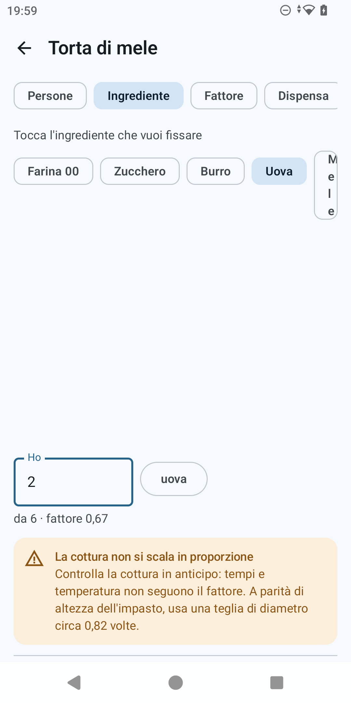

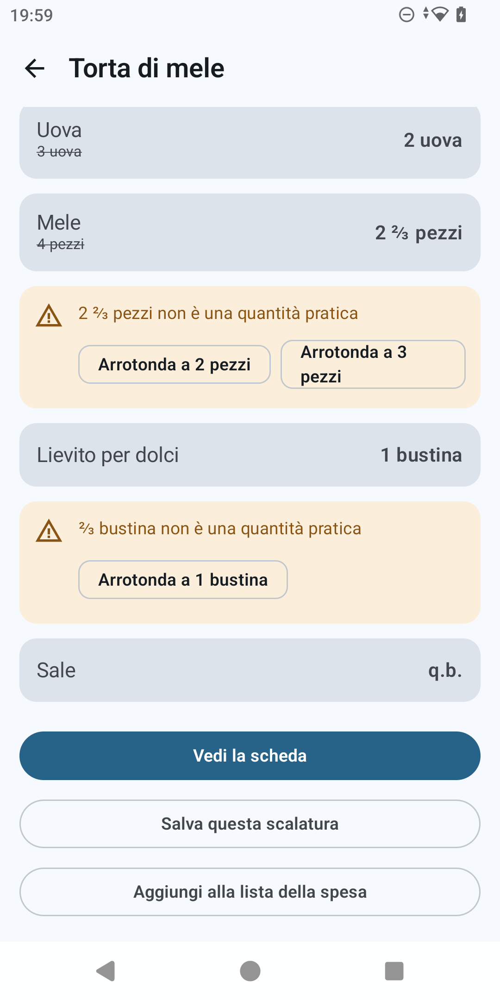

---

## 5. Riproporziona con quello che hai in dispensa

La modalità **Dispensa** risponde alla domanda opposta: "con quello che ho in casa, per quante
persone posso farla?"

1. Dalla schermata di scalatura, tocca il chip **Dispensa**. Compare il testo **"Dimmi quanto hai
   e calcolo il massimo che puoi fare"**, seguito da una riga per ciascun ingrediente scalabile,
   ognuna con la quantità originale della ricetta e un campo **"Ho"**.
2. Nel campo **"Ho"** della riga **Burro** scrivi `60` (hai solo 60 g invece dei 100 g richiesti);
   nel campo **"Ho"** della riga **Farina 00** scrivi `300` (ne hai 300 g invece di 350 g).
   Lascia vuote le altre righe: la Dispensa considera solo gli ingredienti per cui hai indicato
   una quantità.
3. L'app calcola un fattore candidato per ciascun ingrediente indicato (Burro: 60/100 = 0,6;
   Farina 00: 300/350 ≈ 0,86) e prende il più piccolo: il **Burro** diventa il **collo di
   bottiglia** — la sua riga mostra l'etichetta **"Collo di bottiglia"** sotto il nome — e il
   fattore complessivo è 0,6.
4. Sotto le righe compare **"Puoi farne per circa 3,6 persone"**: con quello che hai, la torta
   riesce solo per un numero non intero di persone, e l'app lo dice chiaramente invece di
   arrotondare in silenzio.
5. Poiché hai indicato più farina di quanta ne serva al fattore 0,6 (che ne richiede 210 g), in
   fondo compare la riga **"Avanzano: Farina 00 90 g"**: è quanto ti resterà nella dispensa dopo
   aver fatto la torta a questa scala.
6. Anche qui compaiono gli avvisi sulle quantità discrete non pratiche (Uova a 1,8, con i chip
   **"Arrotonda a 1 uovo"** e **"Arrotonda a 2 uova"**; Mele a 2,4, con i chip **"Arrotonda a 2
   pezzi"** e **"Arrotonda a 3 pezzi"**; Lievito per dolci a 0,6, con il solo chip **"Arrotonda a
   1 bustina"**) e l'avviso forno, sullo stesso principio delle sezioni precedenti (qui il
   rapporto è "circa 0,77 volte").

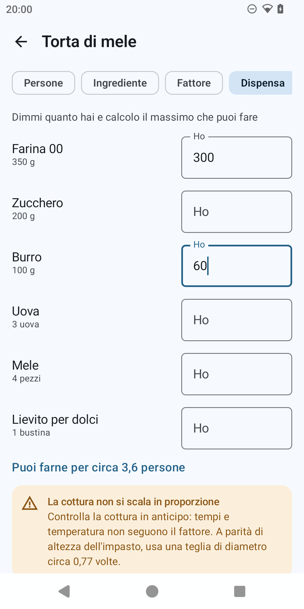

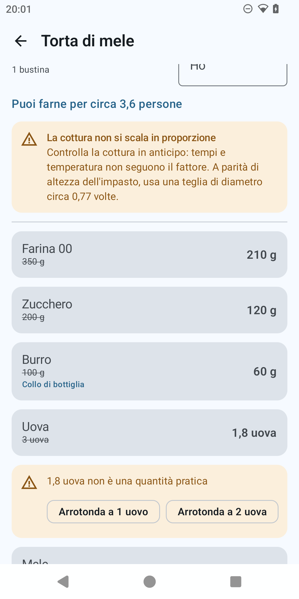

---

## 6. Salva una scalatura e impostala come predefinita

Una scalatura calcolata al volo si può salvare per riaprirla in futuro senza ricalcolarla.

1. Torna alla modalità **Persone** impostata a `9` (sezione 3). Dalla schermata di regolazione o
   dalla scheda scalata, tocca **"Salva questa scalatura"**.
2. Si apre il dialogo **"Salva questa scalatura"** con il campo **"Nome"** già precompilato con
   **"Per 9 persone"** (puoi modificarlo liberamente) e, sotto, una riga con una casella e il
   testo **"Mostra questa scalatura per impostazione predefinita aprendo la ricetta"**.
3. Spunta quella casella, poi tocca **"Salva"** (resta disattivo finché il nome è vuoto). Il
   pulsante **"Annulla"** chiude il dialogo senza salvare.
4. Torna al dettaglio della ricetta: sotto il procedimento compare ora la sezione **"Scalature
   salvate"** con una scheda **"Per 9 persone"**. Toccandola, il dettaglio mostra le quantità di
   quella scalatura con in cima la fascia **"Stai vedendo: Per 9 persone · Visualizza
   l'originale"**; toccando **"Visualizza l'originale"** si torna alle quantità per 6 persone.
5. Avendo impostato questa scalatura come predefinita, la prossima volta che apri la Torta di mele
   dal Ricettario il dettaglio si apre già mostrando le quantità per 9 persone, con la stessa
   fascia in cima — finché non tocchi esplicitamente "Visualizza l'originale" o un'altra
   scalatura.

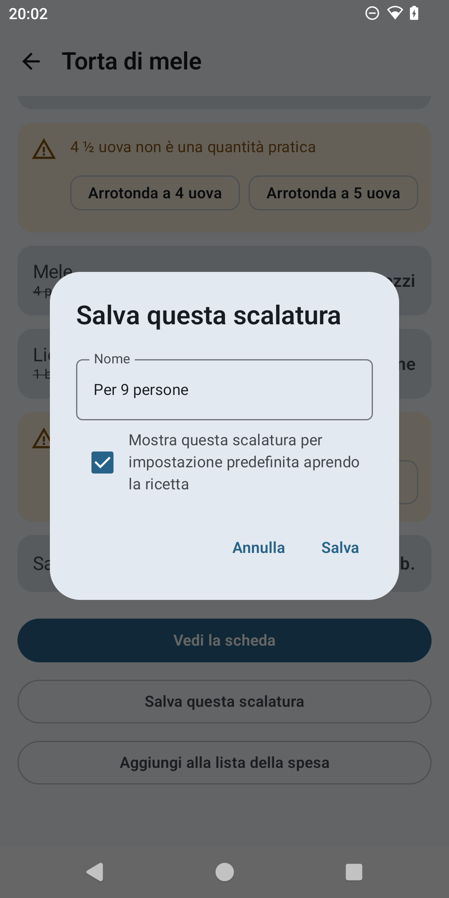

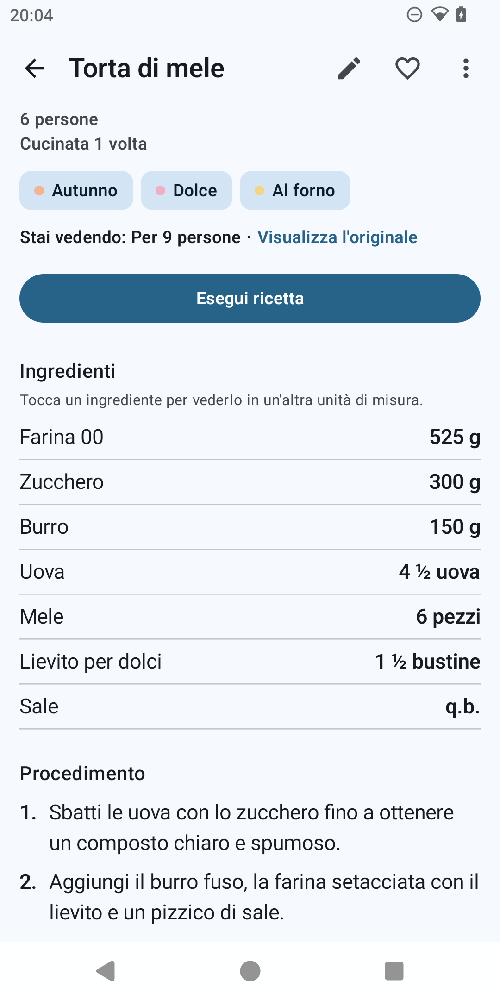

---

## 7. Cucinala

La modalità cucina tiene lo schermo sempre acceso, ingrandisce il testo e permette di spuntare i
passi mentre cucini, con le quantità sempre a portata di tocco.

1. Dalla scheda scalata (sezione 3 o 6), tocca **"Inizia a cucinare"** in fondo. Entrando in
   modalità cucina l'app registra la cottura: incrementa il contatore "cucinata N volte" della
   ricetta e aggiorna la data dell'ultima cottura (per questo compare poi nella card "Continua a
   cucinare" della Home, sezione 10).
2. La barra superiore mostra il titolo della ricetta, la X per chiudere a sinistra, e a destra il
   progresso **"0 / 4"** (zero passi completati su quattro).
3. Ogni passo è un testo grande con una casella di spunta. Tocca la casella (o l'intera riga) del
   primo passo per segnarlo fatto: il testo si barra e diventa grigio, e il contatore in alto sale
   a **"1 / 4"**.
4. Il pulsante **"Ingredienti"** in basso a destra (con l'icona di un libro) apre un foglio con la
   didascalia **"Per 9 persone"** e l'elenco di tutti gli ingredienti con le quantità della
   scalatura in uso, senza dover uscire dalla modalità cucina.
5. La X in alto a sinistra chiude la modalità cucina e torna al dettaglio della ricetta. Lo
   schermo torna a poter spegnersi da solo.

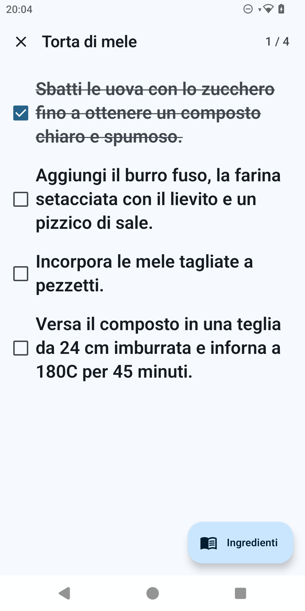

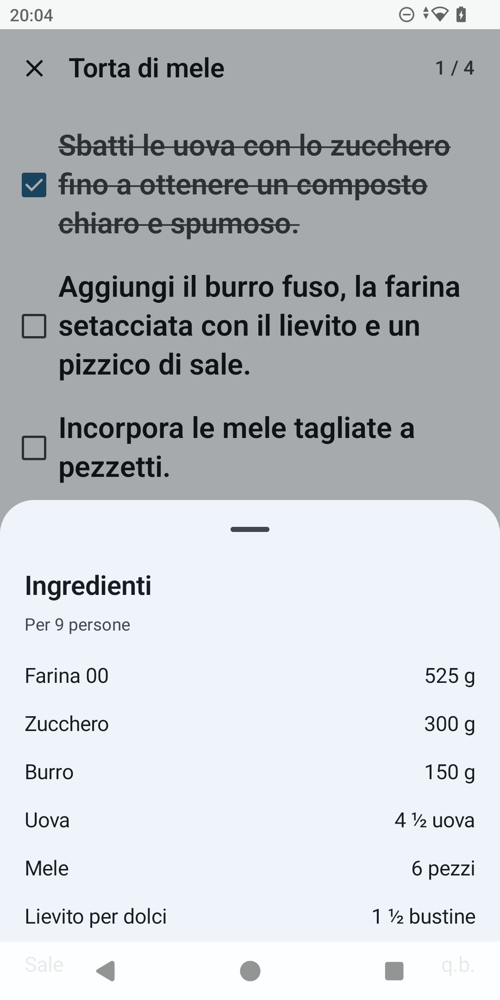

---

## 8. Condividi una ricetta come testo e come file; ricevine una

Dal dettaglio della ricetta, il menu con i tre puntini in alto a destra ("Altre azioni") offre
**Modifica**, **Condividi come testo**, **Condividi file .proportion** ed **Elimina**.

1. Apri il dettaglio della Torta di mele e tocca l'icona dei tre puntini, poi **"Condividi come
   testo"**. Si apre il selettore di condivisione di Android intitolato **"Condividi ricetta"**
   con il testo pronto per un'app di messaggistica: titolo, persone, ingredienti allineati,
   procedimento numerato e, in fondo, la riga discreta **"Condivisa con ProPortion"**. Se al
   momento della condivisione stai visualizzando una scalatura (sezione 6), viene condivisa quella
   — con la riga **"Riproporzionata per 9 persone"** al posto di "Per 6 persone" — non la ricetta
   originale.
2. Tocca di nuovo i tre puntini, poi **"Condividi file .proportion"**: si apre lo stesso tipo di
   selettore, questa volta per un file (`torta-di-mele.proportion`) generato al volo e allegato
   tramite `FileProvider` — utile per mandare la ricetta a un altro utente di ProPortion con tutte
   le informazioni intatte (tag, ingredienti, varianti salvate), non solo il testo leggibile.
3. **Per ricevere una ricetta**: quando qualcuno ti manda un file `.proportion` (per esempio via
   chat o email) e lo apri dall'app che lo ha ricevuto, Android lo apre con ProPortion — l'app è
   registrata per l'estensione `.proportion`. ProPortion si apre direttamente sulla schermata
   **Impostazioni**, con lo stesso dialogo di anteprima usato per il ripristino (sezione 9): il
   numero di ricette contenute nel file e quante sono già presenti nella tua libreria, con la
   scelta fra **"Unisci"** e **"Sostituisci tutto"**.

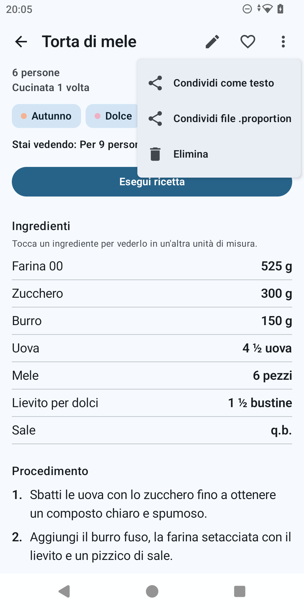

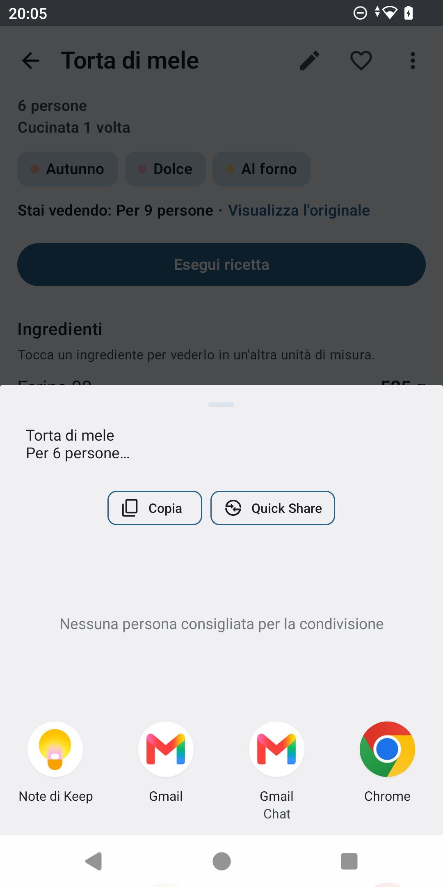

*(La schermata di ricezione di un file .proportion non è illustrata — riusa lo stesso dialogo di
Ripristino mostrato nella sezione 9 qui sotto.)*

---

## 9. Backup e ripristino di tutta la libreria

Dalla scheda **Impostazioni**, la sezione **"Le tue ricette"** offre il backup e il ripristino
dell'intera libreria (tutte le ricette, i tag, il catalogo ingredienti e le varianti salvate).

1. Apri **Impostazioni** e tocca la voce **"Salva tutte le ricette"** (sottotitolo: "Scrive un
   file .proportion dove preferisci."). Si apre il selettore di sistema per scegliere dove
   salvare il file; scelta la destinazione, compare la conferma **"Backup salvato"**.
2. Per ripristinare, tocca **"Ripristina da un backup"** (sottotitolo: "Legge un file .proportion
   e chiede conferma prima di cambiare qualcosa.") e scegli un file `.proportion` con il selettore
   di sistema.
3. Prima di scrivere qualunque cosa, compare il dialogo **"Ripristino"** con il conteggio, per
   esempio **"42 ricette nel file, 12 già presenti."**, e due scelte: **"Unisci"** (le ricette già
   presenti, riconosciute per identificativo univoco, non vengono duplicate) oppure **"Sostituisci
   tutto"**.
4. Scegliendo **"Sostituisci tutto"** compare una seconda conferma esplicita, perché è distruttiva:
   **"Sostituire tutte le ricette?"** ("Le ricette attuali verranno eliminate e sostituite da
   quelle nel file."), con i pulsanti **"Sostituisci"** e **"Annulla"**.
5. Al termine, un ultimo dialogo riassume l'esito: **"X ricette aggiunte, Y saltate"** per
   **Unisci**, oppure **"X ricette ripristinate"** per **Sostituisci tutto**, con un pulsante
   **"OK"**. Se il file non è valido, l'app mostra invece uno fra tre messaggi d'errore chiari:
   "Questo non è un file ProPortion.", "Questo file è stato scritto da una versione più recente
   dell'app (N)." o "Non riesco a leggere questo file."

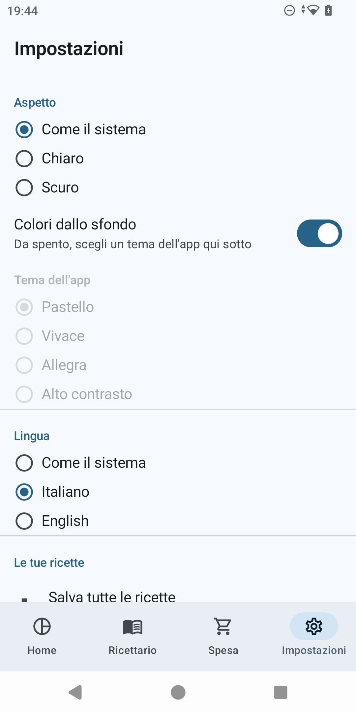

*(Il dialogo di Ripristino e quello di esito finale non sono illustrati in questo giro — servirebbe
un vero file di backup sul device da cui scegliere.)*

---

## 10. La dashboard e la lista della spesa

Con qualche ricetta in libreria — includendo la Torta di mele cucinata almeno una volta (sezione
7) — la Home mostra quattro schede animate all'apertura.

1. La scheda **"La tua libreria"** mostra un donut animato con il numero di ricette per portata
   al centro, la legenda a fianco (per esempio "Dolce · 1"), e sotto due righe con il totale delle
   cotture registrate e il numero di preferiti.
2. La scheda **"Continua a cucinare"** mostra l'ultima ricetta cucinata — la Torta di mele — con,
   se era in uso una scalatura, la riga **"Salvata come Per 9 persone"**, e un pulsante
   **"Cucina"** che riapre direttamente la modalità cucina con quella stessa scalatura.
3. La scheda **"Più cucinate"** affianca due colonne, **"Più cucinate"** e **"Preferite"**: per
   aggiungere la Torta di mele ai preferiti, aprine il dettaglio e tocca l'icona a forma di cuore
   in alto a destra (che passa da vuota a piena).
4. La scheda **"Cosa cucino?"** propone una ricetta a caso, filtrabile per portata con i chip in
   alto (incluso il chip **"Tutte le portate"**); l'icona con le frecce circolari propone
   un'altra idea con una piccola animazione di ricambio.
5. Apri la scheda **Spesa**: gli ingredienti aggiunti dalla schermata di scalatura (pulsante
   **"Aggiungi alla lista della spesa"**, sezioni 3–5) compaiono qui come un'unica lista. Le
   quantità dello stesso ingrediente si sommano quando le unità sono compatibili (per esempio
   300 g e 0,2 kg diventano 500 g) e restano separate quando non lo sono; ogni riga che proviene
   da più ricette mostra sotto il nome una nota tipo **"Da 2 ricette"**. Tocca la casella per
   segnare un articolo come già preso: il testo si barra.
6. Il menu con i tre puntini in alto a destra nella lista della spesa offre **"Condividi"** (apre
   il selettore di sistema con la lista come testo semplice, titolata **"Condividi lista della
   spesa"**), **"Rimuovi già presi"** (attivo solo se c'è almeno un articolo spuntato) e **"Svuota
   tutto"**, che prima di procedere chiede conferma con il dialogo **"Svuotare tutta la lista?"**
   ("Ogni articolo, preso o no, verrà rimosso.").

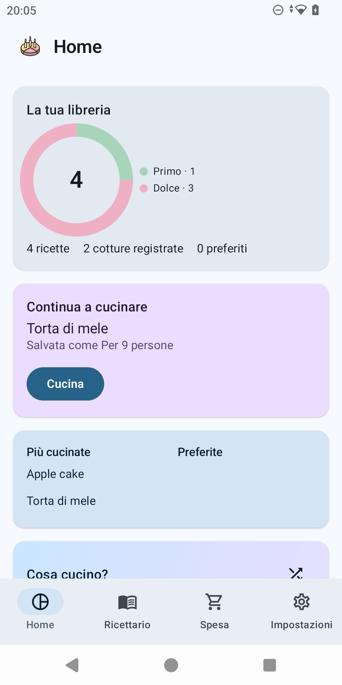

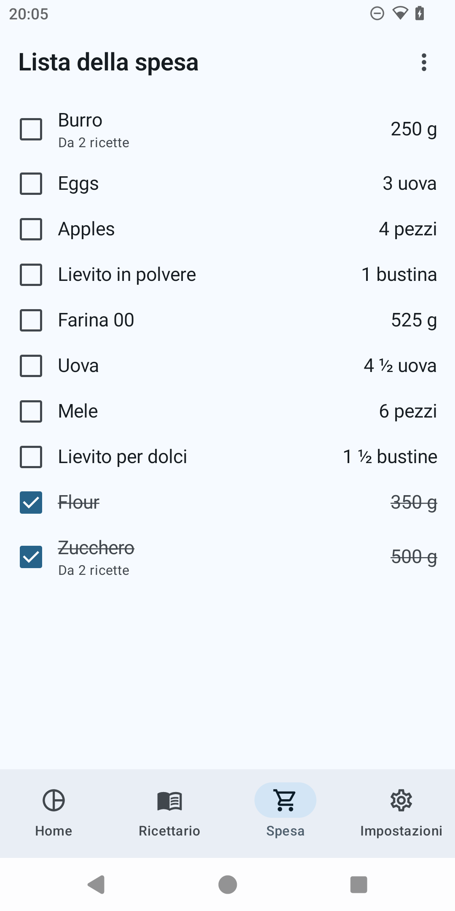
