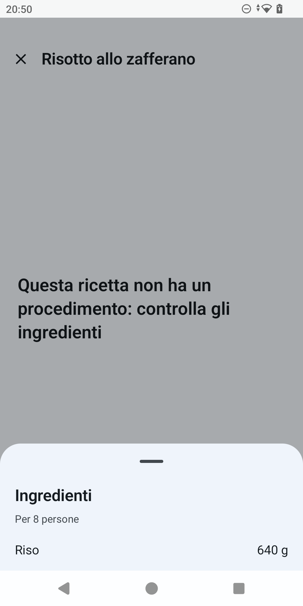

# ProPortion

ProPortion is an Android app that rescales cooking recipes. It works entirely offline: no account
is needed, there is no synchronisation, and there is no data collection.

The problem it solves is simple: you enter a recipe with its quantities and the number of people
it is meant for, then re-derive every quantity from a single constraint — a different number of
servings, the amount you have of one ingredient, a multiplier, or the ingredients you actually
have in the pantry.

The value it adds over doing the maths by hand is culinary correctness: it knows that eggs cannot
be halved, that "a pinch of salt" does not scale, and that a cake baked at 1.5x the recipe does
not bake for 1.5x the time.

> **A note on the pictures.** The screenshots below are still from the Italian-language app — an
> English-locale recapture is a planned follow-up, not done yet.

## What it does

- **Recipe entry and search.** Title, servings, tags (by course: appetizer, first course, main
  course, side dish, dessert, bread and leavened goods, preserves, drinks, plus your own tags),
  ingredients with typed units of measure, and the procedure steps. The recipe list filters by
  free text, tags and ingredients at the same time.
- **Four ways to rescale a recipe:**
  - **by servings** — pick a new number of servings and every quantity updates;
  - **by an ingredient** — say how much you have of one ingredient and everything else adjusts;
  - **by factor** — a direct multiplier (×0.5, ×2, ×3, or any value you choose);
  - **by what is in the pantry** — enter how much you have of one or more ingredients and the app
    computes the limiting factor, flags the ingredient that is the bottleneck, states how many
    servings you can actually make, and lists what is left over.

  

- **Warnings when quantities do not come out even.** If an ingredient is discrete (eggs, cloves,
  slices, sachets…) and rescaling would produce a non-whole number, the app flags it with a
  warning and proposes rounding it, recomputing the whole recipe accordingly.
- **Oven advisory.** For recipes tagged as baked in the oven, if the scaling factor falls outside
  the 0.7x–1.4x band the app warns that baking time and temperature do not scale proportionally,
  and suggests a new tin diameter at the same batter depth.
- **Saved scalings.** A rescaling can be saved as a variant with a label (e.g. "For 6") without
  ever changing the original recipe, and one variant can be set as the default shown when the
  recipe is reopened.
- **Sharing.** A recipe can be shared as plain text, ready for a messaging app, or as a
  `.proportion` file. Opening a received `.proportion` file starts the import.
- **Backup and restore of the whole library.** A backup includes recipes, tags, the ingredient
  catalogue and variants; restoring shows a preview before writing anything and lets you choose
  between merging with what is already there or replacing everything.
- **Dashboard.** Library numbers, a breakdown of recipes by course, the last recipe you were
  cooking to pick back up, the most-cooked and favourite recipes, and a random "what shall I
  cook?" suggestion.
- **Shopping list.** One persistent list. Quantities of the same ingredient are merged when the
  units are compatible and kept as separate lines otherwise; each line remembers which recipe it
  came from.
- **Cooking mode.** Keeps the screen on, enlarges the text, shows checkable steps, and keeps the
  scaled quantities one tap away.

  

- **Convert between weight, volume and count.** A recipe written in cups can be rescaled by saying
  how much you have in grams, and any ingredient line can be viewed in another unit of measure —
  including imperial ones (ounces, pounds, fluid ounces, pints, quarts, gallons) — via each
  ingredient's density or per-item weight. The first time it is needed for a given ingredient, the
  app asks for that one number and remembers it from then on.

- **Favourites** with a counter of how many times a recipe has been cooked.
- **Italian and English**, chosen independently of the device's own language from Settings, or left
  to follow the system.
- **Appearance.** Colours can follow your wallpaper (Material You, Android 12+), or — with that
  off — pick one of four built-in themes: Pastel, Vivid, Playful, or a high-contrast theme built to
  a stricter accessibility standard. Each adapts to light and dark mode.

## What it does not do (yet)

ProPortion has no accounts, does not sync anything to the cloud, does not handle recipe photos, and
does not import recipes from pasted text.

## Licence

ProPortion is free software, licensed under the **GNU General Public License v3.0**. The full text
is in the [`LICENSE`](../../../LICENSE) file at the root of the repository.

## Privacy

See [`privacy.md`](privacy.md).

## What's new

See [`changelog.md`](changelog.md).
