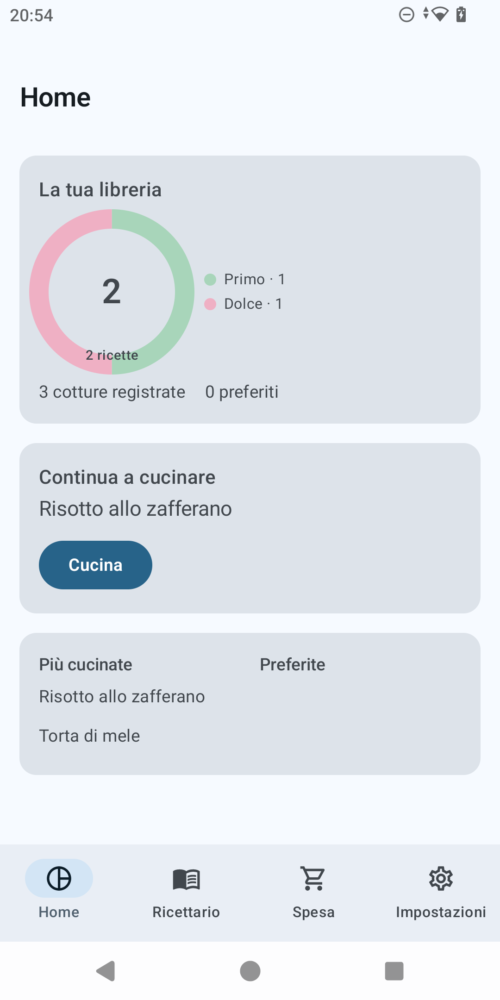
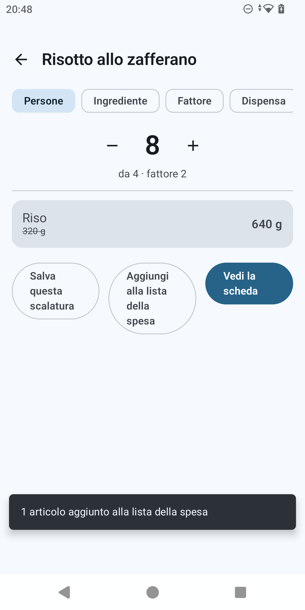

# ProPortion

ProPortion è un'app Android che ricalcola le dosi delle ricette di cucina. Funziona
completamente offline: non serve un account, non c'è alcuna sincronizzazione, e non c'è nessuna
raccolta dati.

Il problema che risolve è semplice: si inserisce una ricetta con le sue quantità e il numero di
persone per cui è pensata, e poi si ricalcola ogni quantità a partire da un solo vincolo — un
numero di persone diverso, la quantità disponibile di un ingrediente, un moltiplicatore, oppure
gli ingredienti che si hanno davvero in dispensa.

Il valore aggiunto rispetto a fare i conti a mente è la correttezza in cucina: l'app sa che le
uova non si possono dimezzare, che "un pizzico di sale" non si scala, e che una torta cotta a
1,5× la dose non cuoce per 1,5× il tempo.

## Cosa fa

- **Inserimento e ricerca ricette.** Titolo, persone, tag (per portata: antipasto, primo,
  secondo, contorno, dolce, pane e lievitati, conserve, bevande, più i tag personali), ingredienti
  con unità di misura tipizzate, e i passaggi del procedimento. La lista delle ricette si filtra
  per testo libero, tag e ingredienti contemporaneamente.
- **Quattro modi per ricalcolare una ricetta:**
  - **per persone** — si sceglie un nuovo numero di persone e tutte le quantità si aggiornano;
  - **per un ingrediente** — si dice quanto se ne ha di un ingrediente e il resto si adegua;
  - **per fattore** — un moltiplicatore diretto (×0,5, ×2, ×3, o un valore a piacere);
  - **per quello che c'è in dispensa** — si indica quanto si ha di uno o più ingredienti e l'app
    calcola il fattore limitante, segnala l'ingrediente che fa da collo di bottiglia, dice quante
    porzioni si riescono a fare e cosa avanza.

  

- **Avvisi quando le quantità non tornano.** Se un ingrediente è discreto (uova, spicchi, fette,
  bustine…) e il ricalcolo darebbe un numero non intero, l'app lo segnala con un avviso e propone
  di arrotondare, ricalcolando l'intera ricetta di conseguenza.
- **Avviso forno.** Per le ricette contrassegnate come da forno, se il fattore di scala esce dalla
  fascia 0,7×–1,4× l'app avvisa che tempo e temperatura di cottura non scalano in proporzione e
  suggerisce un nuovo diametro della teglia a parità di spessore dell'impasto.
- **Scalature salvate.** Una scalatura si può salvare come variante con un'etichetta (es. "Per 6")
  senza mai modificare la ricetta originale, e se ne può impostare una come predefinita per
  quando si riapre la ricetta.
- **Condivisione.** Una ricetta si condivide come testo semplice, pronto per un'app di
  messaggistica, oppure come file `.proportion`. Aprire un file `.proportion` ricevuto avvia
  l'importazione.
- **Backup e ripristino di tutta la libreria.** Il backup include ricette, tag, catalogo
  ingredienti e varianti; il ripristino mostra un'anteprima prima di scrivere qualunque cosa e
  lascia scegliere tra unire con quanto già presente o sostituire tutto.
- **Dashboard.** Numeri della libreria, ripartizione delle ricette per portata, l'ultima ricetta
  cucinata da riprendere, le più cucinate e le preferite, e un suggerimento casuale per "cosa
  cucino?".
- **Lista della spesa.** Un'unica lista persistente. Le quantità dello stesso ingrediente si
  sommano quando le unità sono compatibili, altrimenti restano righe separate; ogni riga ricorda
  da quale ricetta viene.
- **Modalità cottura.** Schermo che resta acceso, testo ingrandito, passaggi spuntabili, e le
  quantità scalate sempre a un tocco di distanza.

  

- **Conversione tra peso, volume e quantità.** Una ricetta scritta in tazze può essere scalata
  dicendo quanto se ne ha in grammi, e ogni riga ingrediente può essere vista in un'altra unità di
  misura — incluse quelle imperiali (once, libbre, once fluide, pinte, quarti, galloni) — tramite
  la densità o il peso a pezzo di ciascun ingrediente. La prima volta che serve per un dato
  ingrediente, l'app chiede quel dato e lo ricorda da allora in poi.

- **Preferiti** con contatore delle volte in cui una ricetta è stata cucinata.
- **Italiano e inglese**, scelti in Impostazioni indipendentemente dalla lingua del dispositivo,
  oppure lasciati seguire il sistema.
- **Aspetto.** I colori possono seguire lo sfondo del telefono (Material You, Android 12+), oppure
  — a quella disattivata — si può scegliere uno tra quattro temi: Pastello, Vivace, Allegra, o un
  tema ad alto contrasto pensato per un livello di accessibilità più rigoroso. Ognuno si adatta a
  tema chiaro e scuro.

## Cosa non fa (ancora)

ProPortion non ha account, non sincronizza nulla nel cloud, non gestisce foto delle ricette, e non
importa ricette da testo incollato.

## Licenza

ProPortion è software libero, distribuito sotto licenza **GNU General Public License v3.0**. Il
testo completo è nel file [`LICENSE`](../../../LICENSE) alla radice del repository.

## Privacy

Vedi [`privacy.md`](privacy.md).

## Novità

Vedi [`changelog.md`](changelog.md).
